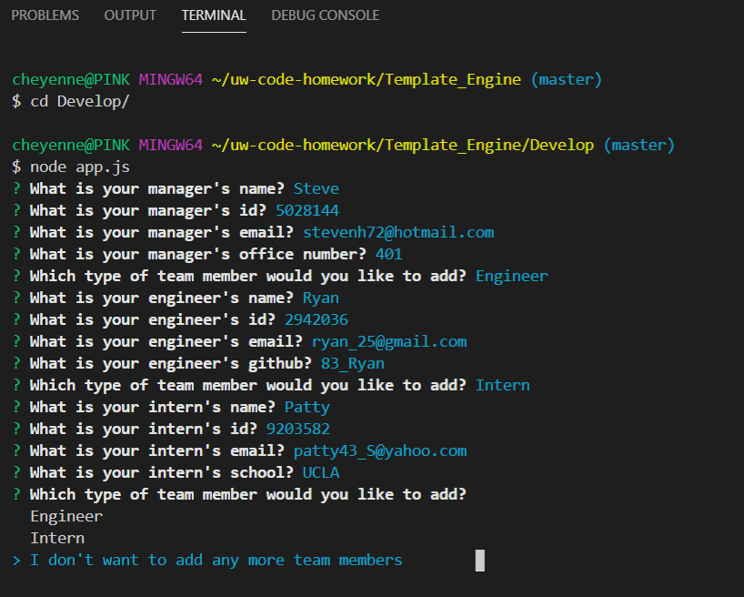
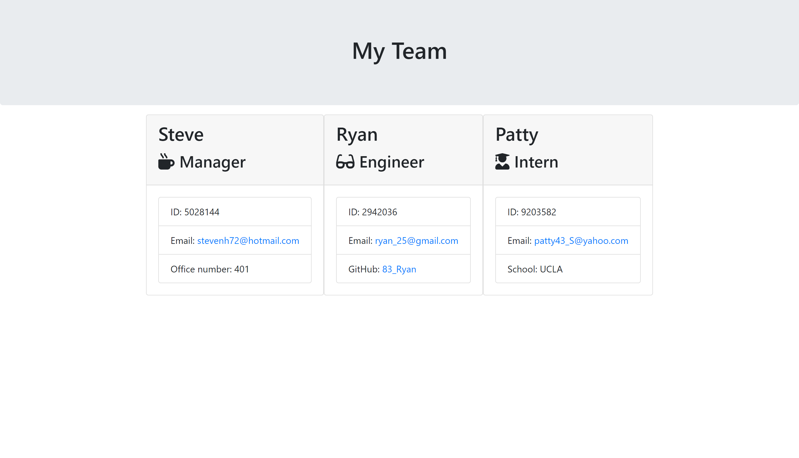

# Template_Engine

## Demo

## Table of contents

- [General info](#general-info)
- [Technologies](#Technologies)
- [Summary](#Summary)
- [Usage](#Usage)
- [Expectations](#Expectations)
- [Author](#Author)
- [License](#License)

## General info

CLI app that helps generate an employee engine profile `app.js` will ask you a series of questions.

## Technologies

package.json
JavaScript
Node.js

## Summary

Employee engine created using node.js

## Usage

Make sure you create a .gitignore including files node_modules/ and .DS_store/
Next you want to npm install
After you npm install you want to make sure you are in the correct directory and run `node app.js`
There you will be asked a series of questions to build your team and a user can add as many engineers and interns as they want. 
When the user is done building their team a "team.html" file will be generated in the output folder.
The user will redirect into the team.html file and can display their results in the browser. 

## Expectations

## Author

Cheyenne Hunt

## License

Open Source